# Actividad 4.2 - Estándares de Codificación
# María Virginia Mendizábal Miranda - A01796588

Repositorio con tres programas desarrollados en Python que implementan algoritmos básicos sin depender de funciones integradas del lenguaje. Todos los programas siguen el estándar de codificación **PEP-8** y fueron validados con **pylint** obteniendo una calificación de **10.00/10**.

---

## Estructura del repositorio

```
actividad-4-2-coding-standards/
├── exercise1_compute_statistics/
│   ├── computeStatistics.py
│   ├── data/               (TC1.txt … TC7.txt)
│   └── evidence/           (capturas de pantalla)
├── exercise2_converter/
│   ├── convertNumbers.py
│   ├── data/               (TC1.txt … TC4.txt)
│   └── evidence/           (capturas de pantalla)
├── exercise3_word_count/
│   ├── wordCount.py
│   ├── data/               (TC1.txt … TC5.txt)
│   └── evidence/           (capturas de pantalla)
└── README.md
```

## Ejecución

Cada programa se ejecuta desde la línea de comandos recibiendo como argumento un archivo de texto con los datos de entrada:

```bash
python computeStatistics.py fileWithData.txt
python convertNumbers.py fileWithData.txt
python wordCount.py fileWithData.txt
```

Los resultados se imprimen en consola y se guardan automáticamente en un archivo de resultados dentro de la misma carpeta de ejecución.

---

## Ejercicio 1 - Compute Statistics (`computeStatistics.py`)

### Descripción

Este programa lee un archivo de texto que contiene valores numéricos (uno por línea) y calcula las siguientes estadísticas descriptivas:

| Estadística | Algoritmo utilizado |
|---|---|
| **Count** | Conteo de elementos válidos |
| **Mean** | Suma total / cantidad de elementos |
| **Median** | Valor central de la lista ordenada con Merge Sort |
| **Mode** | Valor con mayor frecuencia (o `#N/A` si no hay repetidos) |
| **Variance** | Varianza poblacional (divide entre *n*) |
| **Standard Deviation** | Raíz cuadrada de la varianza usando Newton-Raphson |

Todas las operaciones se realizan con algoritmos propios; no se utilizan librerías como `statistics` ni funciones integradas como `sorted()`.

Los datos inválidos se reportan como error en consola y se omiten del cálculo. El archivo de salida generado es `StatisticsResults.txt`.

### Casos de prueba ejecutados

Se ejecutaron **7 casos de prueba** (TC1 a TC7) que cubren distintos escenarios: conjuntos de datos pequeños, grandes, con valores negativos, decimales, datos inválidos mezclados, entre otros.

### Evidencias

**Evidencia 1** - Ejecución de los casos de prueba TC1 a TC5. Se observan los resultados de cada ejecución mostrando las estadísticas calculadas (COUNT, MEAN, MEDIAN, MODE, STANDARD_DEVIATION, VARIANCE y ELAPSED_TIME_SECONDS). En el caso TC5 se demuestra el manejo de datos inválidos, donde el programa reporta las líneas con errores y continúa el procesamiento con los valores válidos.

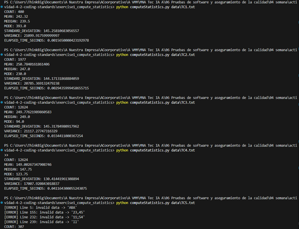

**Evidencia 2** - Ejecución de los casos de prueba TC6 y TC7, que incluyen conjuntos de datos más grandes con notación científica. Además, se muestran las dos ejecuciones de **pylint** sobre el archivo `computeStatistics.py`, obteniendo en ambas una calificación perfecta de **10.00/10**, lo que confirma el cumplimiento total del estándar PEP-8.

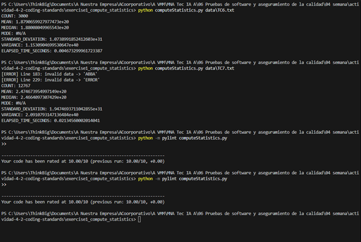

---

## Ejercicio 2 - Convert Numbers (`convertNumbers.py`)

### Descripción

Este programa lee un archivo de texto con números enteros (uno por línea) y los convierte a sus representaciones en **binario** y **hexadecimal** utilizando algoritmos básicos de división sucesiva.

| Conversión | Detalle |
|---|---|
| **Binario** | División sucesiva entre 2. Para negativos se usa complemento a dos de 10 bits. |
| **Hexadecimal** | División sucesiva entre 16. Para negativos se usa complemento a dos de 40 bits. |

No se utilizan funciones integradas como `bin()`, `hex()` o `format()`. Los datos inválidos (texto, valores vacíos, etc.) se reportan en consola y se omiten de la tabla de resultados. El archivo de salida generado es `ConvertionResults.txt`.

### Casos de prueba ejecutados

Se ejecutaron **4 casos de prueba** (TC1 a TC4) que incluyen números positivos, negativos, valores con signo explícito (`+` / `-`), datos inválidos y conjuntos de datos de distintos tamaños (desde pocos elementos hasta 200 registros).

### Evidencias

**Evidencia 1** - Fragmento final de la ejecución del caso de prueba TC1 (200 elementos). Se muestra la tabla con las columnas ITEM, DECIMAL, BINARY y HEXADECIMAL, junto con el tiempo de ejecución al final.

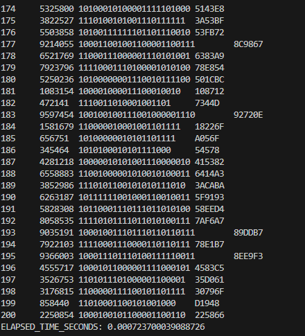

**Evidencia 2** - Fragmento final de la ejecución del caso de prueba TC2 (200 elementos). Se puede observar la conversión correcta de números enteros grandes a binario y hexadecimal.

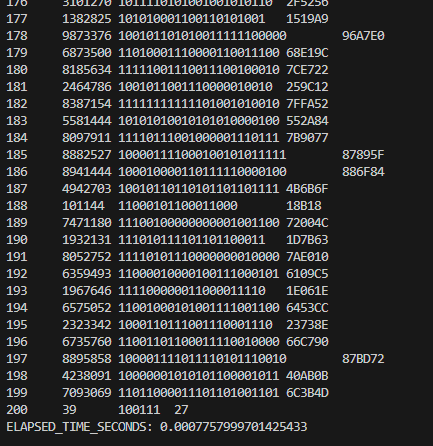

**Evidencia 3** - Ejecución del caso de prueba TC3, que contiene números positivos y negativos. Se puede apreciar el correcto funcionamiento del complemento a dos tanto en binario (10 bits) como en hexadecimal (40 bits) para los valores negativos.

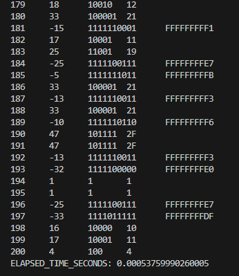

**Evidencia 4** - Ejecución del caso de prueba TC4, que incluye datos inválidos mezclados con datos válidos. Se observan los mensajes de error para las líneas con datos no numéricos (como `'ABC'`, `'ERROR'` y `'VAL'`) y cómo el programa continúa procesando correctamente el resto de los datos, incluyendo conversiones de números negativos con complemento a dos.

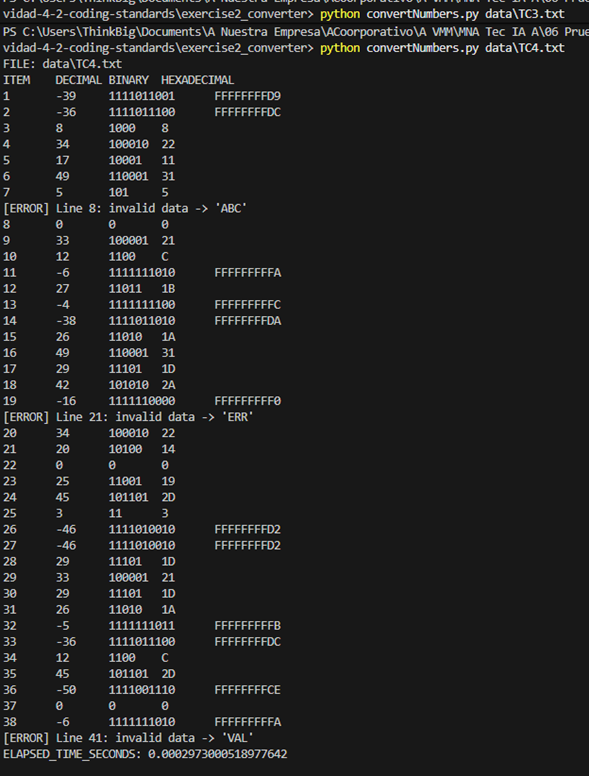

**Evidencia 5** - Ejecución de **pylint** sobre el archivo `convertNumbers.py`, obteniendo una calificación perfecta de **10.00/10**, confirmando que el código cumple completamente con el estándar PEP-8.

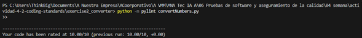

---

## Ejercicio 3 - Word Count (`wordCount.py`)

### Descripción

Este programa lee un archivo de texto y cuenta la frecuencia de cada palabra distinta. Los resultados se presentan ordenados de mayor a menor frecuencia utilizando un algoritmo de **Insertion Sort** implementado manualmente.

| Funcionalidad | Detalle |
|---|---|
| **Lectura de palabras** | Se separan por espacios en blanco, línea por línea |
| **Conteo de frecuencia** | Diccionario que acumula las apariciones de cada palabra |
| **Ordenamiento** | Insertion Sort descendente por frecuencia |
| **Salida** | Tabla con cada palabra y su frecuencia, total general y tiempo de ejecución |

No se utilizan funciones de ordenamiento integradas como `sorted()` ni `list.sort()`. El archivo de salida generado es `WordCountResults.txt`.

### Casos de prueba ejecutados

Se ejecutaron **5 casos de prueba** (TC1 a TC5) con archivos de texto de distintos tamaños: 100, 104, 500, 1000 y 5000 palabras respectivamente.

### Evidencias

**Evidencia 1** - Ejecución del caso de prueba TC1 (100 palabras). Se muestra el listado de palabras con su frecuencia y el total general (Grand Total: 100), junto con el tiempo de ejecución.

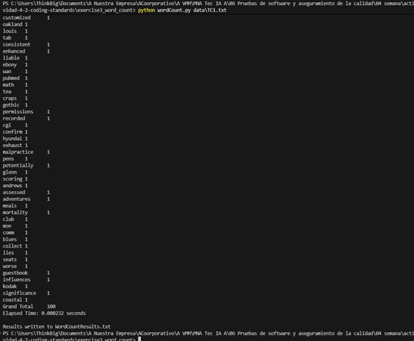

**Evidencia 2** - Ejecución del caso de prueba TC2 (104 palabras). Se observa el conteo correcto de frecuencias para un conjunto de datos similar al anterior.

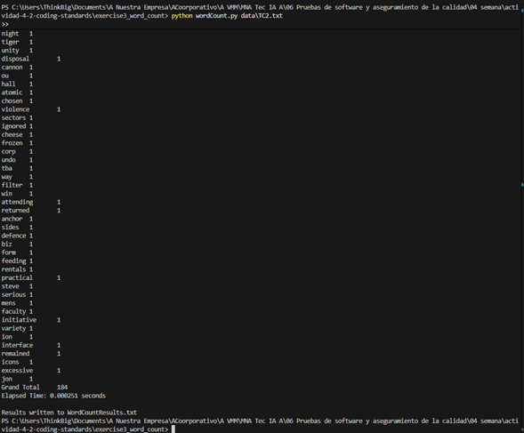

**Evidencia 3** - Ejecución del caso de prueba TC3 (500 palabras). El programa procesa correctamente un volumen intermedio de datos y muestra los resultados ordenados por frecuencia descendente.

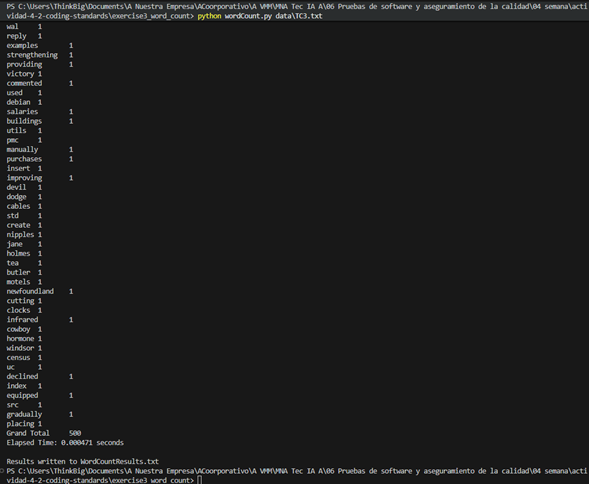

**Evidencia 4** - Ejecución del caso de prueba TC4 (1000 palabras). Se demuestra que el programa maneja sin problema conjuntos de datos más grandes, manteniendo el conteo y ordenamiento correcto.

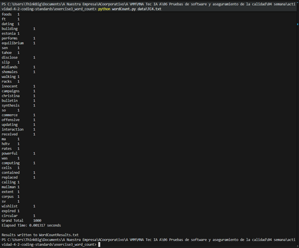

**Evidencia 5** - Ejecución del caso de prueba TC5 (5000 palabras). Este es el caso de prueba más grande, y el programa completa el procesamiento y genera los resultados correctamente.

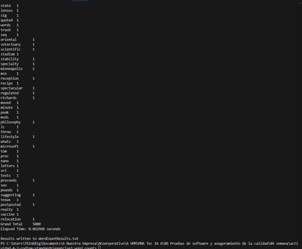

**Evidencia 6** - Ejecución de **pylint** sobre el archivo `wordCount.py`, obteniendo una calificación perfecta de **10.00/10**, confirmando que el código cumple completamente con el estándar PEP-8.

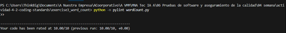

---

## Cumplimiento del estándar PEP-8

Los tres programas fueron analizados con **pylint** y obtuvieron la calificación máxima de **10.00/10**:

| Programa | Calificación pylint |
|---|---|
| `computeStatistics.py` | 10.00/10 |
| `convertNumbers.py` | 10.00/10 |
| `wordCount.py` | 10.00/10 |

Esto garantiza que el código cumple con las convenciones de estilo de Python definidas en PEP-8, incluyendo: nombres de variables y funciones en `snake_case`, docstrings descriptivos, manejo adecuado de imports, longitud de línea controlada y estructura limpia del código.
