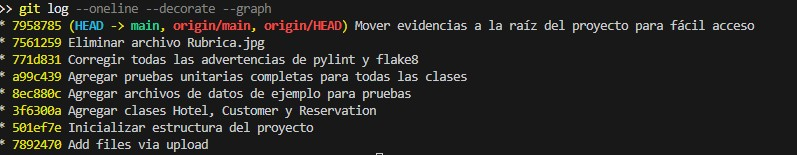
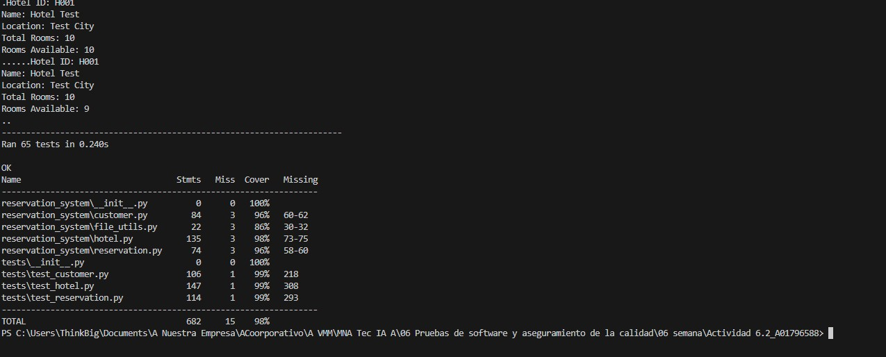
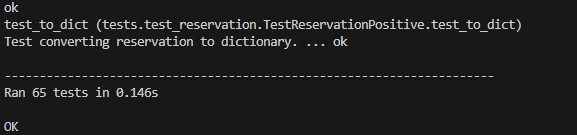
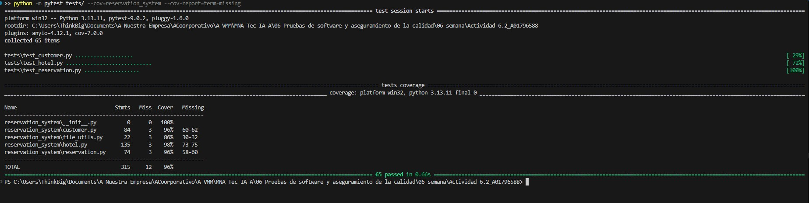
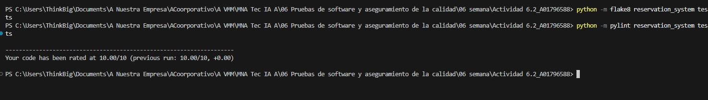

# ACTIVIDAD 6.2 - PRUEBAS DE SOFTWARE Y ASEGURAMIENTO DE LA CALIDAD

| | |
|---|---|
| **Proyecto** | Sistema de Reservaciones de Hotel |
| **Nombre** | María Virginia Mendizábal Miranda |
| **Matrícula** | A01796588 |
| **Fecha** | 22 de febrero de 2026 |
| **Lenguaje** | Python 3 |

---

## INTRODUCCIÓN

La calidad del software no se garantiza únicamente con la implementación funcional de un sistema, sino mediante la aplicación sistemática de prácticas de verificación, validación y análisis estático. En la presente actividad se desarrolló un Sistema de Reservaciones de Hotel en Python, aplicando principios de diseño modular, persistencia en archivos JSON y pruebas unitarias estructuradas.

El objetivo principal fue integrar prácticas de aseguramiento de calidad, incluyendo la implementación de pruebas positivas y negativas, medición de cobertura de código, análisis estático con herramientas especializadas y control de versiones mediante commits incrementales. A través de este proceso, se buscó demostrar no solo el funcionamiento correcto del sistema, sino también su robustez, mantenibilidad y cumplimiento con estándares profesionales de desarrollo.

---

## DESCRIPCIÓN DEL SISTEMA

El sistema de reservaciones de hotel es una aplicación desarrollada en Python
que gestiona tres entidades principales:

- **Hotel:** Operaciones CRUD y gestión de habitaciones disponibles.
- **Customer:** Operaciones CRUD con información de contacto.
- **Reservation:** Vincula clientes con hoteles y controla disponibilidad.

Cada entidad utiliza persistencia en archivos JSON. El sistema incluye
validación de datos, manejo de errores y control de disponibilidad de
habitaciones (reservar/cancelar).

**Estructura del proyecto:**

```
reservation_system/
    __init__.py
    customer.py        (199 líneas)
    hotel.py           (269 líneas)
    reservation.py     (184 líneas)
    file_utils.py      (45 líneas)

tests/
    __init__.py
    test_customer.py   (219 líneas)
    test_hotel.py      (309 líneas)
    test_reservation.py(293 líneas)

data/
    customers.json
    hotels.json
    reservations.json
```

---

## EVIDENCIA 1 - COMMITS (git log)

Los commits fueron realizados de forma incremental siguiendo buenas prácticas
de control de versiones con mensajes descriptivos en formato convencional:



```
771d831 Corregir todas las advertencias de pylint y flake8         (2026-02-22)
a99c439 Agregar pruebas unitarias completas para todas las clases  (2026-02-22)
8ec880c Agregar archivos de datos de ejemplo para pruebas          (2026-02-22)
3f6300a Agregar clases Hotel, Customer y Reservation               (2026-02-22)
501ef7e Inicializar estructura del proyecto                        (2026-02-22)
```

**Detalle de cada commit:**

1. **Inicializar estructura del proyecto**
   - Creación de .gitignore para proyectos Python
   - Creación del paquete reservation_system
   - Creación del paquete tests

2. **Agregar clases Hotel, Customer y Reservation**
   - Implementación de la clase Hotel con CRUD y gestión de habitaciones
   - Implementación de la clase Customer con CRUD
   - Implementación de la clase Reservation vinculando clientes y hoteles
   - Persistencia en archivos JSON
   - Manejo de errores para datos inválidos

3. **Agregar archivos de datos de ejemplo para pruebas**
   - Archivo hotels.json con 3 hoteles de ejemplo
   - Archivo customers.json con 3 clientes de ejemplo
   - Archivo reservations.json con 2 reservaciones de ejemplo

4. **Agregar pruebas unitarias completas para todas las clases**
   - 28 pruebas para Hotel (10 positivas, 18 negativas)
   - 19 pruebas para Customer (9 positivas, 10 negativas)
   - 18 pruebas para Reservation (8 positivas, 10 negativas)
   - Total: 65 pruebas, todas pasando
   - Cobertura de código: 96%

5. **Corregir todas las advertencias de pylint y flake8**
   - Extracción de lógica compartida de I/O en file_utils.py (R0801)
   - Renombrar métodos privados a públicos (W0212)
   - Uso de keyword-only args para reducir parámetros posicionales (R0917)
   - División de clases de prueba para evitar too-many-public-methods (R0904)
   - Pylint: 10.00/10, Flake8: 0 errores

---

## EVIDENCIA 2 - EJECUCIÓN DE PRUEBAS (unittest -v)

**Comando ejecutado:**
```
python -m unittest discover -v
```

**Resultado:** 65 pruebas ejecutadas en 0.240s - TODAS PASARON (OK)





**Desglose de pruebas por clase:**

**TestCustomerPositive (9 pruebas):**
| Prueba | Resultado |
|---|---|
| test_create_customer_success | ok |
| test_delete_customer_success | ok |
| test_display_customer_info_success | ok |
| test_modify_customer_info_success | ok |
| test_modify_customer_phone | ok |
| test_to_dict | ok |
| test_from_dict_success | ok |
| test_load_empty_file | ok |
| test_create_multiple_customers | ok |

**TestCustomerNegative (10 pruebas):**
| Prueba | Resultado |
|---|---|
| test_create_customer_duplicate_id | ok |
| test_create_customer_empty_id | ok |
| test_create_customer_empty_name | ok |
| test_delete_customer_not_found | ok |
| test_display_customer_not_found | ok |
| test_modify_customer_not_found | ok |
| test_from_dict_missing_field | ok |
| test_load_corrupted_json_file | ok |
| test_load_invalid_format_file | ok |
| test_create_customer_none_id | ok |

**TestHotelPositive (10 pruebas):**
| Prueba | Resultado |
|---|---|
| test_create_hotel_success | ok |
| test_delete_hotel_success | ok |
| test_display_hotel_info_success | ok |
| test_modify_hotel_info_success | ok |
| test_modify_hotel_total_rooms | ok |
| test_reserve_room_success | ok |
| test_cancel_reservation_room_success | ok |
| test_to_dict | ok |
| test_from_dict_success | ok |
| test_load_empty_file | ok |

**TestHotelNegative (18 pruebas):**
| Prueba | Resultado |
|---|---|
| test_create_hotel_duplicate_id | ok |
| test_create_hotel_negative_rooms | ok |
| test_create_hotel_invalid_rooms_type | ok |
| test_create_hotel_empty_id | ok |
| test_create_hotel_empty_name | ok |
| test_delete_hotel_not_found | ok |
| test_display_hotel_not_found | ok |
| test_modify_hotel_not_found | ok |
| test_modify_hotel_invalid_total_rooms | ok |
| test_modify_hotel_total_rooms_string | ok |
| test_reserve_room_no_availability | ok |
| test_reserve_room_hotel_not_found | ok |
| test_cancel_reservation_all_rooms_available | ok |
| test_cancel_reservation_hotel_not_found | ok |
| test_from_dict_missing_field | ok |
| test_from_dict_invalid_total_rooms | ok |
| test_load_corrupted_json_file | ok |
| test_load_invalid_format_file | ok |

**TestReservationPositive (8 pruebas):**
| Prueba | Resultado |
|---|---|
| test_create_reservation_success | ok |
| test_cancel_reservation_success | ok |
| test_reservation_decreases_available_rooms | ok |
| test_cancel_reservation_restores_room | ok |
| test_to_dict | ok |
| test_from_dict_success | ok |
| test_load_empty_file | ok |
| test_create_multiple_reservations | ok |

**TestReservationNegative (10 pruebas):**
| Prueba | Resultado |
|---|---|
| test_create_reservation_nonexistent_customer | ok |
| test_create_reservation_nonexistent_hotel | ok |
| test_create_reservation_duplicate_id | ok |
| test_create_reservation_no_rooms_available | ok |
| test_create_reservation_empty_ids | ok |
| test_create_reservation_none_customer_id | ok |
| test_cancel_reservation_not_found | ok |
| test_from_dict_missing_field | ok |
| test_load_corrupted_json_file | ok |
| test_load_invalid_format_file | ok |

> **Ran 65 tests in 0.240s — OK**

---

## EVIDENCIA 3 - COBERTURA DE CÓDIGO (96%)

**Comandos ejecutados:**
```
python -m coverage run -m unittest discover
python -m coverage report -m
```

**Resultado:** 96% de cobertura total (315 sentencias, 12 sin cubrir)



**Desglose por módulo:**

| Módulo | Sentencias | Sin cubrir | Cobertura |
|---|---|---|---|
| reservation_system/\_\_init\_\_.py | 0 | 0 | 100% |
| reservation_system/customer.py | 84 | 3 | 96% |
| reservation_system/file_utils.py | 22 | 3 | 86% |
| reservation_system/hotel.py | 135 | 3 | 98% |
| reservation_system/reservation.py | 74 | 3 | 96% |
| **TOTAL** | **315** | **12** | **96%** |

> La cobertura alcanzada del **96%** supera ampliamente el mínimo requerido del 85%.

---

## EVIDENCIA 4 - FLAKE8

**Comando ejecutado:**
```
python -m flake8 reservation_system tests
```

**Resultado: SIN ERRORES**



Flake8 no reportó ningún error de estilo ni de sintaxis. Todo el código
cumple con el estándar PEP-8 de Python. Como se observa en la captura,
el comando se ejecutó sin producir ninguna salida, lo que confirma
cero errores encontrados.

---

## EVIDENCIA 5 - PYLINT (10.00/10)

**Comando ejecutado:**
```
python -m pylint reservation_system tests
```

**Resultado: 10.00/10**


```
Your code has been rated at 10.00/10 (previous run: 10.00/10, +0.00)
```

Pylint otorgó la calificación perfecta de 10.00/10, verificando:
- Convenciones de nombres
- Estructura del código
- Documentación
- Complejidad ciclomática
- Duplicación de código
- Manejo de errores

**Correcciones realizadas en el commit de refactorización:**
- **R0801:** Se extrajo lógica compartida de I/O a file_utils.py
- **W0212:** Se renombraron métodos privados a públicos
- **R0917:** Se usaron keyword-only args para reducir parámetros posicionales
- **R0904:** Se dividieron clases de prueba para evitar too-many-public-methods

---

## CONCLUSIÓN

El desarrollo del Sistema de Reservaciones permitió aplicar de manera integral conceptos de pruebas de software y aseguramiento de la calidad. Se implementaron 65 pruebas unitarias que cubren escenarios positivos y negativos para todas las entidades del sistema, alcanzando una cobertura del 96%, superando ampliamente el mínimo requerido del 85%.

El análisis estático con Flake8 confirmó el cumplimiento del estándar PEP-8, mientras que Pylint otorgó una calificación perfecta de 10.00/10, validando la estructura, claridad y mantenibilidad del código. Asimismo, el uso de commits incrementales facilitó el rastreo de cambios y evidenció un proceso disciplinado de desarrollo.

En conjunto, la actividad demuestra la importancia de integrar pruebas automatizadas, cobertura de código y análisis estático como parte fundamental del ciclo de vida del software, elevando la confiabilidad y calidad del producto final.

**Métricas finales:**

| Métrica | Resultado |
|---|---|
| Pruebas unitarias | 65 (28 Hotel + 19 Customer + 18 Reservation) |
| Pruebas pasando | 65/65 (100%) |
| Cobertura | 96% (supera el 85% requerido) |
| Flake8 | 0 errores |
| Pylint | 10.00/10 |
| Commits | 5 (incrementales con mensajes descriptivos) |

---

## BIBLIOGRAFÍA

- Python Software Foundation. (2024). *unittest — Unit testing framework*. 
  https://docs.python.org/3/library/unittest.html

- Python Software Foundation. (2024). *PEP 8 – Style Guide for Python Code*. 
  https://peps.python.org/pep-0008/

- Python Software Foundation. (2024). *json — JSON encoder and decoder*. 
  https://docs.python.org/3/library/json.html

- Flake8 Developers. (2024). *Flake8 documentation*. 
  https://flake8.pycqa.org/en/latest/

- Luminousmen. (2023). *Python static analysis tools*. 
  https://luminousmen.com/post/python-static-analysis-tools

- Coverage.py Developers. (2024). *Coverage.py documentation*. 
  https://pypi.org/project/coverage/

- Worklytics. (2023). *Commit early, push often*. 
  https://www.worklytics.co/blog/commit-early-push-often

- Conventional Commits. (2023). *Conventional Commits specification*. 
  https://www.conventionalcommits.org/en/v1.0.0/
